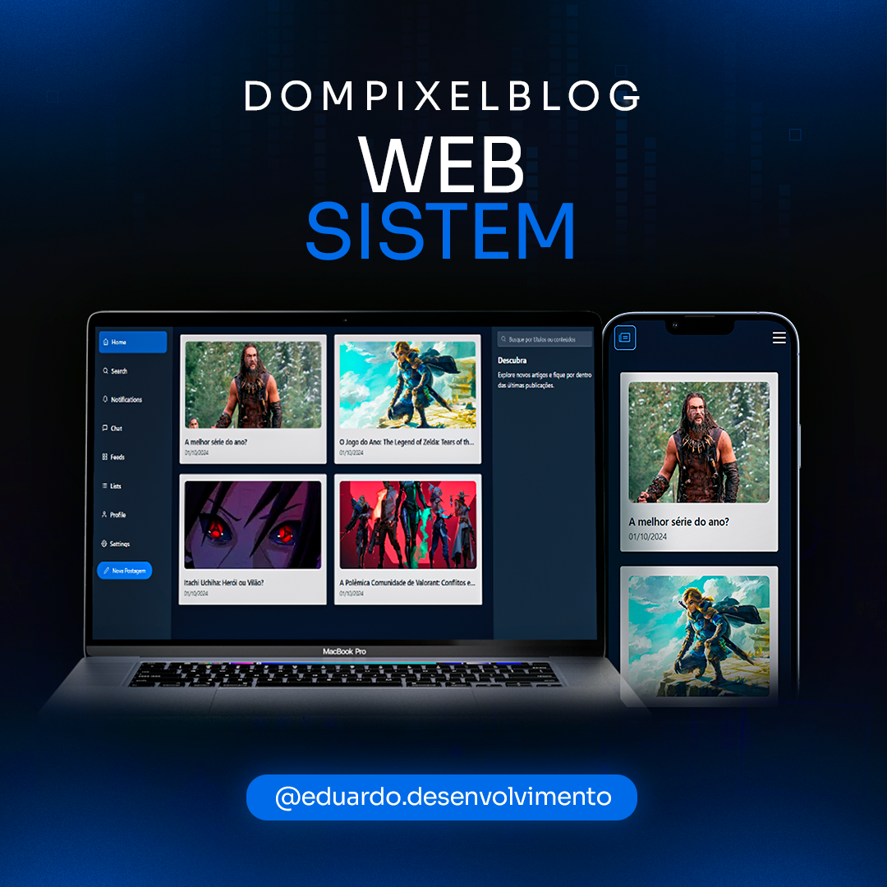

# DompixelBlog

> Uma aplicação permite que os usuários visualizem e criem postagens de blog de maneira simples e intuitiva, utilizando Next.js para uma experiência fluida e responsiva.




## 💻 Pré-requisitos

Antes de começar, verifique se você atendeu aos seguintes requisitos:

- Você instalou a versão 20.9.0 ou superior do `<NodeJS>`
- Você instalou a versão 2.39 ou superior do `<Git>`
- Você tem uma máquina `<Windows / Linux / Mac>`.

## 🚀 Instalando

Para instalar o DompixelBlog, faça isso:

Linux, macOS e Windows:

## 1. Clone o projeto do GitHub:

```
<git clone https://github.com/eduoop/DompixelBlog.git>
```

## 2. Entre na pasta do projeto:

```
<cd DompixelBlog>
```

## 3. Instale as dependências usando o yarn ou npm:

```
<yarn ou npm i>
```

### 4. Crie um arquivo `.env`:

```
Crie um arquivo `.env` na raiz do projeto com o seguinte conteúdo:

NEXT_PUBLIC_API_BASE_URL="http://localhost:3333"
```

## ☕ Usando

```
Para rodar o projeto, abra um terminal na pasta do projeto e rode a api, use: <yarn api ou npm run api>
Depois, rode o frontend em um outro terminal na pasta do projeto, usando: <yarn dev ou npm run dev>
```

## Dificuldades

Durante o processo de desenvolvimento, enfrentei algumas dificuldades. A principal delas foi a falta de tempo, que resultou em uma falta de refinamentos em algumas partes do projeto. Devido aos meus trabalhos, consegui pouco tempo para mexer na aplicação, o que limitou minha capacidade de implementar melhorias e ajustes que gostaria de ter feito. 

Além disso, tive desafios ao fazer o deploy do projeto, já que utilizei o **json-server** para simular a API, e não consegui encontrar uma solução viável para realizar o deploy com essa configuração. 

Apesar dessas dificuldades, peço uma oportunidade para que possam rodar o projeto e ver como ele funciona na prática.

## Tecnologias Utilizadas

- **Next.js** (v14.2.3)
- **Json-server** (v0.17.4)
- **React** (v18)
- **Tailwind CSS** (v3.4.1)
- **TypeScript** (v5.0.0)

## 🤝 Criador

Feito Por:

<table>
  <tr>
    <td align="center">
      <a href="#" title="defina o titulo do link">
        <br>
        <sub>
          <b>Eduardo Meneses</b>
        </sub>
      </a>
    </td>
  </tr>
</table>

## 📝 Licença

Esse projeto está sob licença. Veja o arquivo [LICENÇA](LICENSE.md) para mais detalhes.
